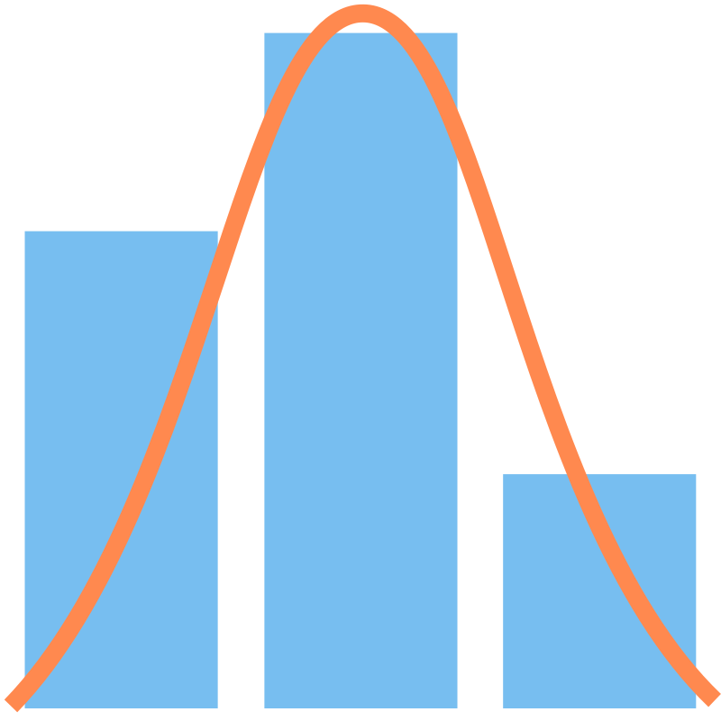

### **EasyBinner: a Power BI histogram-like custom visual**
- [**EasyBinner: a Power BI histogram-like custom visual**](#easybinner-a-power-bi-histogram-like-custom-visual)
- [**Core Purpose: Flexible and Accessible Data Binning**](#core-purpose-flexible-and-accessible-data-binning)
- [**EasyBinner: Precision in Every Bin**](#easybinner-precision-in-every-bin)
- [**Deeper Dive: An Aggregation-Focused Architecture**](#deeper-dive-an-aggregation-focused-architecture)
  - [**Data Model**](#data-model)
  - [**Processing Logic**](#processing-logic)
- [**Key Capabilities**](#key-capabilities)
- [**Benefits to Users**](#benefits-to-users)
- [**Target Audience**](#target-audience)
- [**Usage Guide**](#usage-guide)
- [**License**](#license)

---

### **Core Purpose: Flexible and Accessible Data Binning**

The primary purpose of this chart is to address a common challenge in Power BI: grouping numeric data into equal-sized ranges without altering the underlying data model. All binning and aggregation logic is executed on the front end, running entirely within the secure, sandboxed iframe environment provided by Power BI. This design makes the visual particularly valuable in several scenarios:

  * **When the Data Model is Locked**: Report creators often use certified datasets or live connections, where they lack permissions to create calculated tables or columns. This visual offers a powerful alternative by performing all calculations client-side.

  * **To Avoid Data Model Complexity**: While DAX allows binning in Power BI Desktop, creating calculated tables can be complex. This visual simplifies the process by handling binning logic directly.

  * **When Authoring Reports Online**: In online report editing environments, users often face limited binning and aggregation options. Many built-in or AppSource visuals focus mainly on frequency histograms or have complex features that don’t directly support flexible binning. This visual addresses these gaps by performing all binning and aggregation client-side within the browser, enabling scenarios like grouping individuals by age ranges and displaying the average number of doctor visits per group.

This solution empowers analysts by bringing complex binning logic to the front end in a simple, interactive package. It is subject to Power BI’s custom visual data limits (30,000 data points). For datasets within this threshold, it offers a flexible alternative to modeling. For large or high-cardinality datasets, performance depends on service capabilities and hardware; in such cases, back-end aggregation may be preferable.

---

### **EasyBinner: Precision in Every Bin**

Most histogram visuals prioritize polished styling and rounded, human-friendly bin edges using D3’s automatic “nice” scaling. This often treats your exact bin count or size as a suggestion, favoring readability over precision.

EasyBinner takes a different approach—enforcing your exact bin settings with precision while bringing together accuracy and visual clarity in a clean, readable scale.

Specify 12 bins? You get exactly 12—no rounding, no surprises.

Where other visuals treat your binning parameters as mere hints, EasyBinner treats them as the rule.

---

### **Deeper Dive: An Aggregation-Focused Architecture**

The EasyBinner moves beyond simple frequency counting. It is architected to aggregate a measure across dynamically generated bins of uniform width.

#### **Data Model**

Defined in `capabilities.json`, three data roles drive the visual:

  * **"Field to bin"**: A grouping role for the continuous numeric field to be binned.
  * **"Value"**: A measure role for the field to be aggregated within those bins.
  * **"Frequency measure"**: A measure role for a field used in multiple calculations, including the weighted average and the determination of bin count via Sturges' formula.

#### **Processing Logic**

Upon receiving the DataView object from Power BI, the visual uses D3.js to:

1.  Determine bin thresholds based on the distinct values of the **"Field to bin"**, as grouped by Power BI.
2.  For each bin, calculate the bar height by summing, averaging, or using the minimum/maximum of the measure specified in **"Value"**. The measure values come pre-aggregated by Power BI according to the grouped distinct values.

This approach enables direct visualization of aggregated business measures across a numeric scale.

---

### **Key Capabilities**

  * **True Binned Chart Functionality**: this chart can plot any aggregated numeric measure on the Y-axis. You might use it to display how water consumption varies by household size or to explore device failure rates by operating temperature.

  * **Effortless Equal-Width Bin Generation**:

      * *Automatic*: Calculates bin count using Sturges' formula, treating the frequency measure as *N*.
      * *By Count*: User specifies the desired number of bins.
      * *By Size*: User defines a fixed bin width.

  * **Statistical Context with Normal Curve**: An optional overlay shows a normal distribution curve, based on the mean and standard deviation of the data. The curve’s appearance is customizable.

  * **Rich, Interactive Experience**: Fully supports Power BI interactions—cross-filtering, highlighting, selection, tooltips, and context menus.

  * **Robust and User-Friendly Design**: Guides users with clear error messages and a setup landing page.

  * **Comprehensive Formatting**: Customization options for bar and curve colors, data labels, axis styles, and labeling modes ("Tick value" or "Bin range").

  * **Built for Accessibility & Security**: Includes keyboard navigation, ARIA attributes, and no external calls (empty `privileges` array).

---

### **Benefits to Users**

  * **Unlock Deeper Insights**: Analyze how any measure distributes across a numeric scale—not just counts.
  * **Accelerate Data Exploration**: Try different binning strategies instantly, with no data model changes.
  * **Enhance Statistical Storytelling**: Blend flexible binning with a normal curve for richer narratives.

---

### **Target Audience**

  * **Data Analysts**: Who need to explore distributions of metrics beyond model constraints.
  * **BI Professionals**: Who seek efficient tools to present complex summaries.
  * **Citizen Data Scientists**: Who want intuitive ways to compare data against theoretical distributions.

---

### **Usage Guide**

For step-by-step instructions on configuring and using the EasyBinner, see the [Usage Guide](USAGE.md).

---

### **License**

> See the [LICENSE](./LICENSE) file for details and attribution.  
> See [LICENSE-DATA.md](./LICENSE-DATA.md) for sample dataset licenses and attributions.