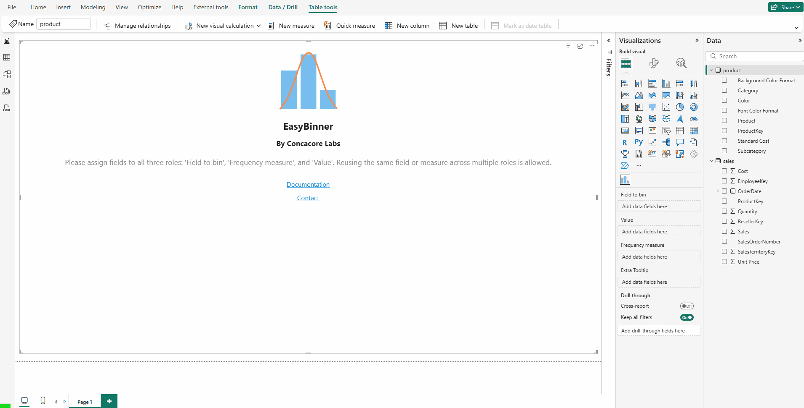

### **EasyBinner: Usage**

- [**EasyBinner: Usage**](#easybinner-usage)
- [**Getting Started: Setting Up Your Chart**](#getting-started-setting-up-your-chart)
- [**Configuring and Formatting Your Chart**](#configuring-and-formatting-your-chart)
  - [**Bins**](#bins)
  - [**Bars**](#bars)
  - [**Important Considerations for Value Calculation**](#important-considerations-for-value-calculation)
  - [**Line (Normal Curve)**](#line-normal-curve)
- [**Interacting with Your Chart**](#interacting-with-your-chart)

Welcome to the EasyBinner! This guide will walk you through everything you need to know to turn your data into powerful, insightful histograms. This visual is designed to group (or "bin") your numeric data on the fly, allowing you to analyze aggregated values like frequencies, averages, sums, minimums, or maximums across different ranges without ever needing to modify your underlying data model.

Let's dive in!

---

### **Getting Started: Setting Up Your Chart**

First, you need to provide the right data. The visual has four data fields that you need to fill in the Power BI Fields pane:

  * **Field to bin (Required):** This is for the continuous, numeric data you want to group into bins. For example, this could be customer age, product temperature, or a student's score. **This field must contain numeric data**.
  * **Value (Required):** This is the numeric measure you want to aggregate and display on the Y-axis. For instance, if you're binning by age, the value could be the *average* number of doctor visits or the *total* sales amount for each age group. **This field must contain a numeric measure**.
  * **Frequency measure (Required):** This is a numeric measure used for weighted average calculations and for determining the number of bins when the "Automatic" bin mode is selected. For example, if you are calculating the average sales per bin, this field would contain the number of sales transactions.
  * **Extra Tooltip:** You can add an additional measure here. Its aggregated value will appear in the tooltip when you hover over a bar, providing extra context.

Once data is assigned to the three required fields, the chart will render automatically. If no data is provided, a landing page will appear with a brief explanation. Using the same field for multiple roles is common in many cases because typical analyses often involve straightforward frequency counts. For example, when analyzing transaction amounts, you might use the **transaction amount** field for **"Field to bin"**, **"Value"**, and **"Frequency measure"**. This setup shows the frequency—the number of transactions—grouped into bins based on the amount, with the Frequency measure representing the total observations.

**Important:** The **Frequency measure** must accurately represent the total number of observations ($N$). In Power BI, the most direct method is to count the rows of your fact table. This is done using a DAX measure like **`COUNTROWS(YourTable)`** or by simply using the default **Count** aggregation on any column that doesn't contain blanks (like a primary key), as this will return the row count for the current context.

For example, suppose you're analyzing how many sales occur within specific product price ranges. The **Product** table contains the *standard price*, and the **Sales** table records individual *sales transactions*, each with a *quantity sold*.

To calculate the total number of items sold, use the `Sum of Quantity` as the **Value** field.
For the **Frequency measure**, use the **Count of Sales**, which corresponds to the number of observations (i.e., sales) in each bin. This is correctly calculated using a `COUNTROWS(Sales)` measure, or by applying the default **Count** on any non-blank field — which Power BI interprets as **`COUNTA(YourField)`**.

This is appropriate because the number of bins is based on the number of **sales**, and each sale is represented by a single row in the **Sales** table — making the count of rows a valid frequency (N) for binning purposes.

> ⚠️ **Note:** The visual does **not** validate or enforce that the selected Frequency measure is appropriate. Using an incorrect measure may lead to incorrect results.

### **Configuring and Formatting Your Chart**

You can customize various aspects of your binning logic, calculation logic, and the visual appearance of your chart. These settings are available under the **Format visual** tab in the Visualizations pane within Power BI.

---

#### **Bins**

This section controls how your data is grouped and how the X-axis (the horizontal axis) is displayed.

  * **Bin mode:** Choose how the chart calculates the size and number of bins.
      * **By count:** You specify the exact **Number of bins** you want to see. The chart will divide your data range into this many equal-width bins. (Default).
      * **By size:** You specify a fixed **Bin size** (width) for every bin.
      * **Automatic:** The chart uses the Sturges' formula based on the total count of your data points (derived from the "Frequency measure" input) to automatically estimate the optimal number of bins.
  * **Bin label:** Choose how the labels on the X-axis appear.
      * **Tick value:** Shows the start and end values of each bin as ticks on the axis.
      * **Bin range:** Displays the full range (e.g., "0 - 10", "10 - 20") centered under each bar.
  * **Font:** Customize the appearance of the X-axis labels, including font family, size, and style (bold/italic).

---

#### **Bars**

This section lets you format the bars and their corresponding data labels.

* **Bar color:** Sets the fill color for all bars in the chart.
* **Y tick font:** Customize the font, size, and style for the labels on the Y-axis (the vertical axis).
* **Value calculation:** This option determines how the **"Value"** measure is aggregated within each bin.
    * **Sum:** The total of all values in the bin. (Default). This is a good choice for additive measures, such as frequencies or sales, where the sum accurately represents the total for the entire bin.
    * **Weighted average:** Averages the values based on a frequency measure. This is crucial for non-additive measures, like an average, where a simple average of values across bins would be misleading.
    * **Minimum:** The smallest value in the bin.
    * **Maximum:** The largest value in the bin.
* **Tooltip calculation:** This option determines how the **"Extra Tooltip"** measure is aggregated within each bin. It appears only when you provide a field in the **"Extra Tooltip"** data role.
    * **Sum:** The total of all tooltip values in the bin. (Default).
    * **Weighted average:** Averages the tooltip values based on a frequency measure.
    * **Minimum:** The smallest tooltip value in the bin.
    * **Maximum:** The largest tooltip value in the bin.
* **Show bar value:** A toggle to turn the data labels on or off for each bar. When this is turned **on**, the following options appear:
    * **Color:** Choose the color of the data labels.
    * **Font:** Set the font family, size, and style for the data labels.
    * **Display units:** Control the units for the data labels (e.g., show values in thousands, millions, etc.).
    * **Value decimal places:** Specify the number of decimal places to show for the data labels.

#### **Important Considerations for Value Calculation**

**Choosing the right calculation method for your data is essential.** The visual is designed for high performance and works with data that is already summarized by your **'Field to bin'**. Your choice in the **Value calculation** setting guides how those summarized values are aggregated further into the final values for each bin you see.

* For **additive measures** (such as total sales or frequency counts, typical of a standard histogram), use the default **Sum** option, which accumulates values across bins. This serves as the default calculation method.
* For **non-additive measures**, the visual supports two main cases:
  * **Averages** (e.g., average price), which require the **Weighted Average** option. This uses the **'Frequency measure'** (such as transaction count) to calculate the average per bin.
  * **Extrema** (e.g., Minimum and Maximum), where the corresponding options compute the smallest or largest values within each bin.

This visual's design prioritizes performance by operating on pre-summarized data from the Power BI model. Consequently, it cannot execute holistic calculations like **median** and **percentiles**, as these require access to the entire raw data **within the visual itself** for sorting and analysis. This limitation is a deliberate architectural trade-off, ensuring it remains lightweight and responsive.

---

#### **Line (Normal Curve)**

This section allows you to overlay a statistical curve on your chart to compare your data's distribution to a normal distribution.

  * **Show normal curve:** A toggle to turn the normal distribution curve on or off. When this is turned **on**, the following options appear:
      * **Curve color:** Sets the color of the line.
      * **Curve thickness:** Adjusts the thickness of the line.

### **Interacting with Your Chart**

Your EasyBinner is fully interactive and works just like other Power BI visuals.

  * **Cross-Filtering:** Clicking on a bar will select it and filter other visuals on your report page. You can select multiple bars by holding down the **Ctrl** key while clicking. Clicking on the chart's background will clear your selection.

  * **Tooltips:** Hover your mouse over any bar to see a detailed tooltip, which shows:

      * The bin range.
      * The bin size.
      * The aggregated value for that bin.
      * The aggregated value of any field you placed in the **Extra Tooltip** data role.

If you have the **Normal Curve** enabled, hovering over the line will show you the Mean, Standard Deviation, and the Expected Value at each intersection with a bin’s midpoint.

  * **Keyboard Navigation:** The visual is fully accessible via the keyboard.

      * Press **Enter** on the visual to focus on the first bar.
      * Use the **Left/Right Arrow** keys to move between bars.
      * Press **Enter** or the **Spacebar** to select a bar.
      * Press **Esc** to clear your selection and return focus to the main visual element.

  * **Context Menu:** Right-click on a bar to open the context menu, which allows you to "Include" or "Exclude" data, just like a standard Power BI chart.